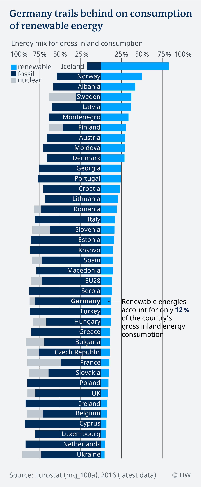

# How dependend are European countries on fossil fuels vs renewable energy?

An extension to the article ["Can Poland end its toxic relationship with coal"](https://www.dw.com/en/can-poland-end-its-toxic-relationship-with-coal/a-46356824)

Idea, analysis, visualization: [Gianna-Carina Grün](https://www.twitter.com/giannagruen)

## Data source

[Eurostat, nrg_100a](http://appsso.eurostat.ec.europa.eu/nui/show.do?dataset=nrg_100a&lang=en)

## Analysis

You can find the analysis process documented [here](Energy_mix_2016-gross-inland-consumption.ipynb)

## Result

